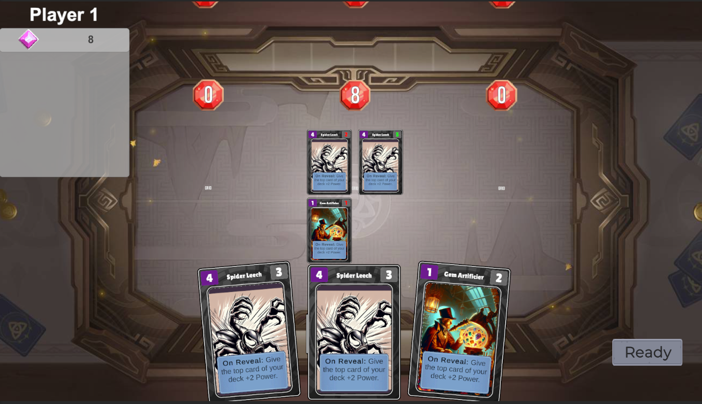
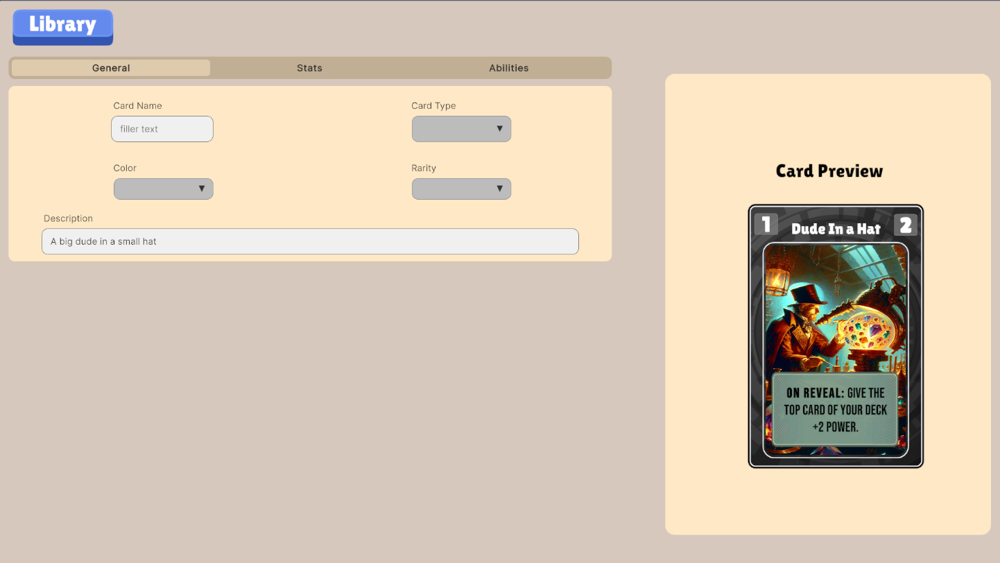

# TCG Simulator

A powerful Unity-based Trading Card Game (TCG) simulator that allows you to create, design, and play custom card games with AI-powered card generation capabilities.

## UPDATE ##
This is the first draft of the TCG game engine, where all of the rule execution is done in Unity C# while it communicates with a python server to retrieve AI generated game components and cards. The  repository is the second stage of the project, containing the AI agent pipeline, new python-based rules engine, and the system infrastructure for developing a game as a user.

## 🎮 Features

### Core Game Systems
- **AI Card Generation**: Use OpenAI to create cards with unique abilities, art, and rules using just text descriptions
- **Card Management System**: Complete card creation, editing, and management with customizable stats (power, cost, abilities)
- **Deck Building**: Intuitive deck builder with card library management
- **Game Engine**: Full-featured TCG engine with phases, turns, and rule systems
- **Targeting System**: Advanced targeting mechanics for card abilities and effects

### AI Integration
- **AI-Powered Card Generation**: Use OpenAI API to automatically generate card designs and abilities
- **AI Game Interface**: Python-based AI interface for automated gameplay and testing
- **Smart Card Balancing**: AI-assisted card balancing and power level assessment

### Gameplay Features
- **Location-Based Combat**: Strategic gameplay with multiple location zones
- **Ability System**: Complex card abilities with triggers, effects, and targets
- **Buff System**: Dynamic buff/debuff mechanics that affect card performance
- **Phase Management**: Turn-based gameplay with multiple phases (draw, play, combat, end)

### User Interface
- **Modern UI**: Clean, intuitive interface built with Unity UI Toolkit
- **Card Library**: Browse and manage your card collection
- **Training Mode**: Practice and test your decks against AI opponents
- **Card Creation Tool**: Visual card creation interface

## 🖼️ Screenshots

### Main Game Interface

*The main TCG gameplay interface showing cards, locations, and game state*

### Card Creation Tool

*AI-powered card creation interface for designing new cards*

## 🛠️ Tech Stack

- **Unity 2022.3+**: Core game engine and rendering
- **C#**: Primary programming language for game logic
- **Python**: AI integration and automated gameplay
- **OpenAI API**: AI-powered card generation
- **Unity UI Toolkit**: Modern user interface components

## 📁 Project Structure

```
Assets/
├── Scripts/
│   ├── Systems/           # Core game systems
│   │   ├── GameSystem.cs
│   │   ├── TargetSystem.cs
│   │   ├── EnergySystem.cs
│   │   ├── ActionSystem.cs
│   │   └── RuleSystem.cs
│   ├── Cards/            # Card-related scripts
│   │   ├── SnapCard.cs
│   │   ├── LocationCard.cs
│   │   └── Abilities/    # Contains ability data and definitions
│   ├── Phases/           # Game phase management
│   ├── Events/           # Event system
│   ├── UI/              # User interface scripts
├── Scenes/
│   └── TCG/             # Game scenes
│       ├── Tcg.unity    # Main game scene
│       ├── CardCreation.unity
│       ├── CardLibrary.unity
│       └── Training.unity
└── UI/                  # UI assets and components
```

## 🎯 Key Systems

### Card System
Cards are the heart of the game, featuring:
- Highly customizable stats (Power, Cost, etc)
- Dynamic ability systems allowing cards to be created through JSON definitions
- Buff/debuff mechanics
- Tag mechanics to categorize cards
- Location-based gameplay

### Targeting System
Advanced targeting mechanics for:
- Card abilities
- Effect applications
- Strategic positioning
- Multi-target effects
- Requirement activation